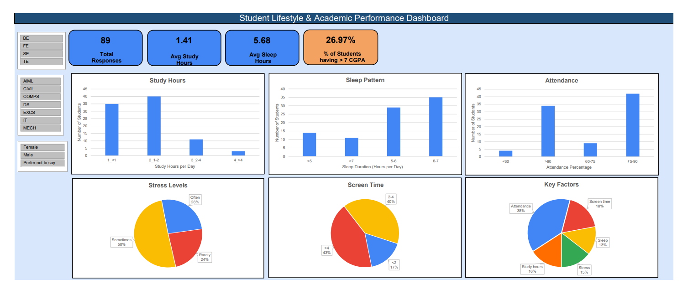

# 📊 Student Lifestyle & Academic Performance – EDA Project

This project analyzes how student lifestyle habits influence academic performance using Exploratory Data Analysis (EDA).
The analysis was performed using survey responses collected through Google Forms and processed in Microsoft Excel.

## 🎯 Objective
To identify how factors such as study hours, sleep duration, attendance, stress, and screen time influence student academic performance.

## 🧠 Methodology
1. Collected 89 student responses using Google Forms
2. Cleaned and organized the dataset in Excel
3. Applied Exploratory Data Analysis techniques
4. Created charts and visualizations
5. Derived meaningful insights for academic decision-making

## 📈 Key Visualizations
- Study Hours Distribution
- Sleep Duration Analysis
- Attendance Percentage
- Academic Stress Levels
- Non-Academic Screen Time
- Factors Affecting Academic Performance

## 🔍 Important Findings
- 43% students spend more than 4 hours on non-academic screen time
- Attendance was identified as the most important factor affecting academic performance (38%)
- Most students study only 1–2 hours daily
- Students sleeping 6–7 hours showed better academic balance

## 📁 Files Included
- `Dashboard.pdf` – Final dashboard
- `Project_Pitch.pptx` – Initial project presentation
- `dataset.csv` – Survey dataset
- `dashboard.png` – Preview image

## 💡 Applications
- Student feedback analysis
- Academic performance studies
- College decision-making
- Survey-based educational research

## 🚀 Future Improvements
- Increase the number of student responses
- Compare academic years and departments
- Add predictive analysis using Python
- Build an interactive dashboard version
